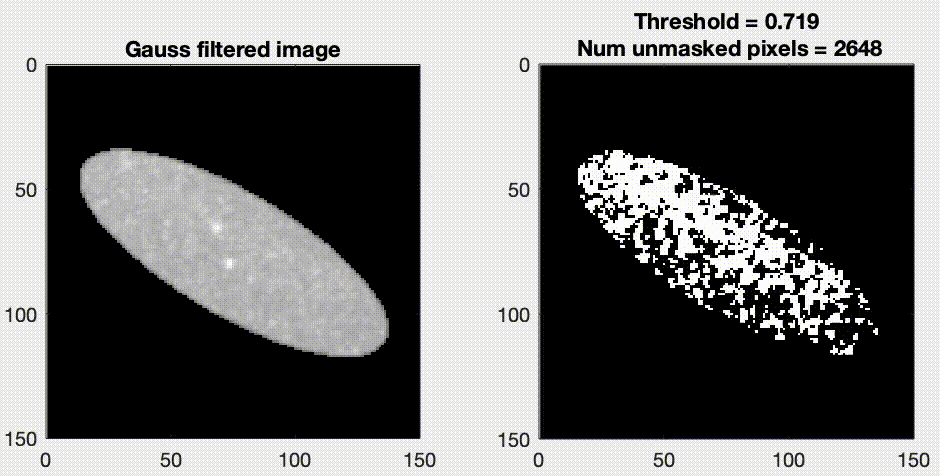

# TAMiT
TAMiT (Toolkit for Automated Microtubule Tracking) is a
microtubule detection and tracking software. It was developed
for use with 3D Fission yeast and Budding yeast cells. TAMiT
finds a variety of microtubule-based structures:
* Spindle-Pole Bodies (Fission and Budding yeast)
* Spindles (Fission and Budding yeast)
* Rigid Microtubules (Fission yeast)
* Curved Microtubules (Budding yeast)
* Kinetochores

TAMiT was designed to be fully automated and written in MATLAB
using Object-Oriented Programing.

### Table of Contents:
* [Installation](#installation)
* [Initialization](#initialization)
* [Usage](#usage)
* [Demos](#demos)

## Installation
You can download TAMiT using git.

```
git clone https://github.com/saadjansari/SingleCell.git
git submodule init
git submodule update
```

Dependencies:
MATLAB (R2019b and later)
[utrack](https://github.com/DanuserLab/u-track)

## Initialization

There are 3 essential initial files that TAMiT needs to run.

##### initParams.m:
Creates the settings needed for running TAMiT. 
User needs to set the following paths:
```Matlab
exec_loc.local.runpath = <path to the TAMiT repo>
exec_loc.local.savepath = <path to results folders> 
```

##### initCellInfo.m:
Specifies information about the cells of interest.
User needs to set the following:
```Matlab
% Path to parent folder containing segmented cell movies
movieParent = '/Users/saadjansari/Documents/Projects/ImageAnalysis/FY Datasets';

% Relative path to segment cell movies
moviePath = {...
     'sid1_cut7/1032_100msR_50msG_7Z_106_cells/1032_100msR_50msG_7Z_106_1.mat',...
};

% Frames to analyze for each cell
lifetime = { ...
            [],...
    };

% Cell Type : 'Mitosis' / 'Monopolar'
type = 'Mitosis';

% Channels to Fit (list of channel numbers)
% Example: [1], [1,2], [] (empty brackets denote all channels)
% Note: length must match the length of channelFeatures. Order must also match the o    rder of features in channelFeatures)
channelsToFit = [1,2];

% Features to fit
% Current available features:
% 'Microtubule', 'Sid4', 'Cut7', 'KC'
channelFeatures = {'Sid4', 'Cut7'};
```

##### initConfiguration.m
This contains configuration info, and other parameters.

## Usage

TAMiT can be run via:
```Matlab
main()
```
This does a few things, in this order:
1. Runs `initParams.m` to create a `params.mat` settings file. TAMiT creates a time-labeled folder in the save path specified by the user. This contains the `params.mat` file. It does it for each cell specified in the `initCellInfo.m` file.
2. Runs `TAMiT.m` in serial fashion for each cell. It provides as input the path to the saved `params.mat` file.

3. Analysis (yet to be added)


## Demos
A major strength of TAMiT lies in its detection / estimation capability. It these demos, we show how TAMiT extracts features from microscopy images.

### Spindle Pole Body Detection (Spots)
Take the following 2D grayscale intensity image. This shows 2 clearly visible spots. The goal is to detect the locations of the spots.
We start by passing the iage through a gaussian filter of some width (1 pixel in this case). This suppresses noise pixels and bring out the relevant signal.
The improvement is evident below.

Original image | Gaussian filtered image
:-------------------------:|:-------------------------:
 | 

Next, we use apriori knowledge about the system. 
* There are only 2 spots. *
* The spots have small extent in XY. *
With this knowledge, we employ an iterative thresholding procedure that masks out background pixels. This stops when the number of unmasked pixels is some small number (in this case 25).



We start by applying MATLAB's `bwareafilt` to remove any connected regions smaller than some area (in this case 7). Then, we use `regionprops` to extract connected regions. The centroids of these regions correspond are good estimates for the spot positions (red).


### Spindle Detection (Line)
Coming soon...

